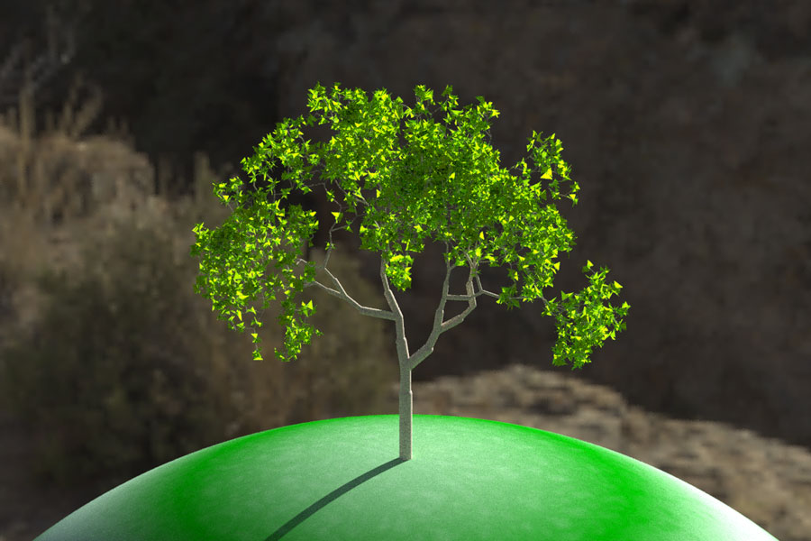
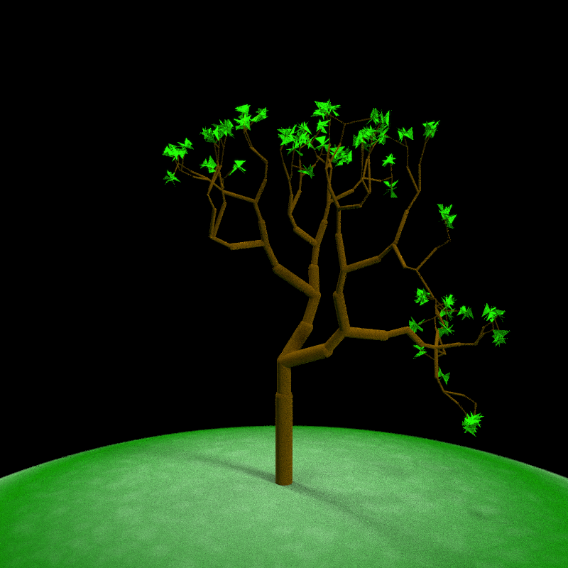
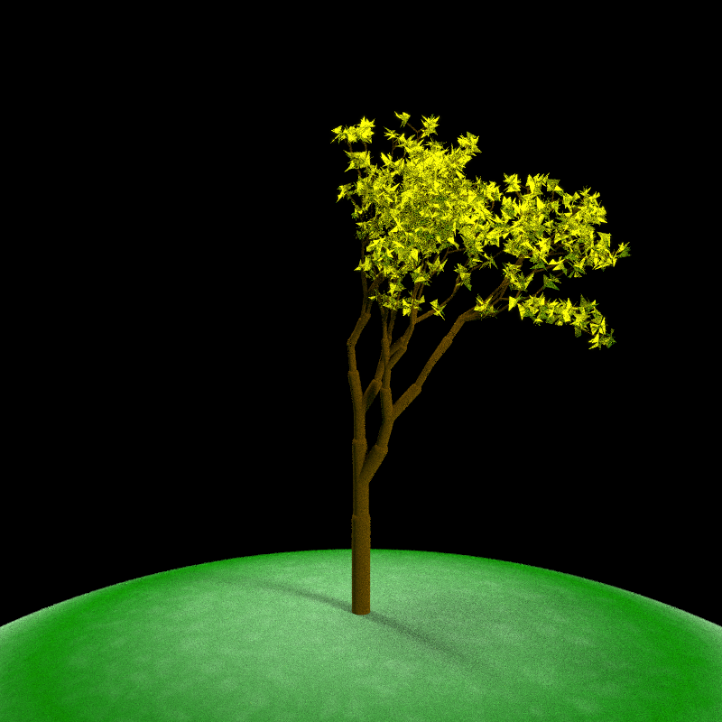
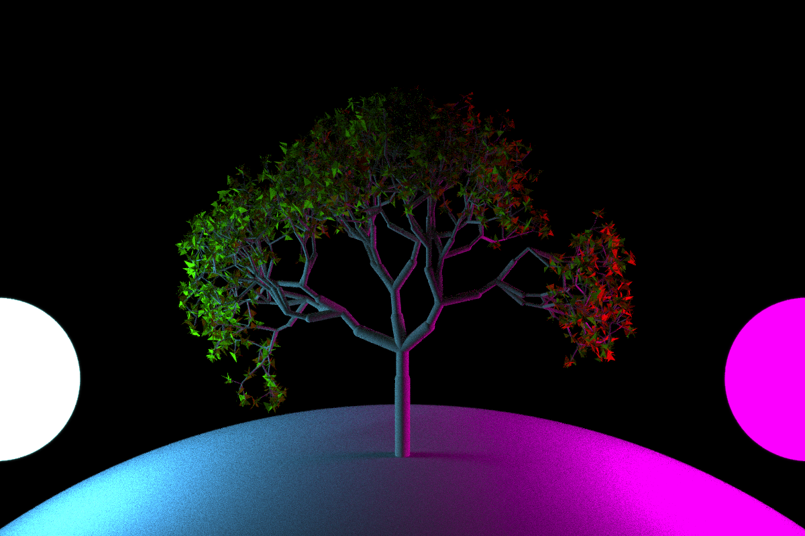
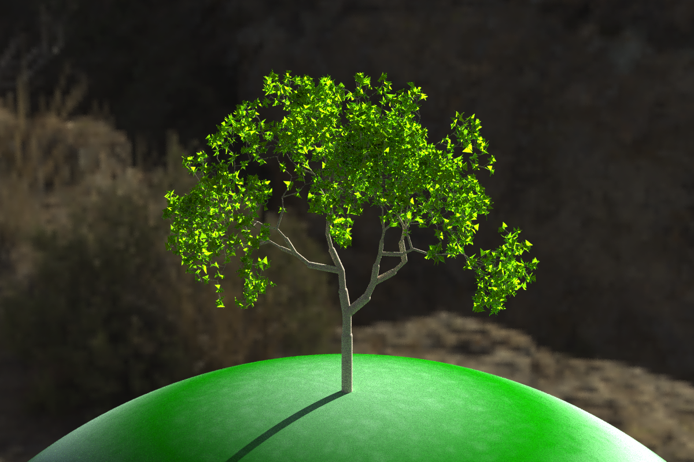

<!-- README.md is generated from README.Rmd. Please edit that file -->

# raybonsai

</img>

<!-- badges: start -->

<!-- badges: end -->

raybonsai: Generate 3D procedural trees in R, rendered with rayrender\!
Procedural generation code based on the flametree package by Danielle
Navarro.

## Installation

You can install *raybonsai* with the remotes package:

``` r
remotes::install_github("tylermorganwall/raybonsai")
```

## Example

There are currently only two user-facing functions in raybonsai:
`generate_tree()` and `render_tree()`. `generate_tree()` generates a
tree that follows a certain set of constraints that you set and returns
a rayrender scene describing the tree. `render_tree()` automatically
adds ground, sets up lighting, and sets up the camera so the tree is in
frame, but is otherwise just a light wrapper around rayrender’s
`render_scene()` function.

Here are some examples:

``` r
library(raybonsai)
library(rayrender)

generate_tree() %>% 
  render_tree(width=800, height=800)
```



Change the branch angles and depth of the tree:

``` r
generate_tree(seed = 4321, branch_angle_vert = seq(-10,20,by=1),
              branch_depth = 8, leaf_color = "yellow", leaf_depth_start = 5) %>% 
  render_tree(width=800, height=800)
```



Adjust the colors of the ground and the tree:

``` r
generate_tree(seed = 20, branch_angle = c(-30,0, 30), branch_scale = c(0.9,1), 
              branch_depth = 7, leaf_color = "chartreuse4", leaf_depth_start = 5, branch_color = "tan") %>% 
  render_tree(ground_color1 = "darkgoldenrod4", ground_color2 = "chocolate4",
              width=800, height=800)
```


Add your own lighting using rayrender:

``` r
generate_tree(seed = 222, branch_angle = c(-20, 20), branch_scale = c(0.8,0.9), branch_split = 3,
              branch_depth = 6 , leaf_color = "chartreuse4", leaf_depth_start = 5, branch_color = "tan") %>% 
  add_object(sphere(x=5,y=1,radius=1,material=light(color="magenta",intensity = 30))) %>%
  add_object(sphere(x=-5,y=1,radius=1,material=light(color="dodgerblue",intensity = 30))) %>%
  render_tree(lights = FALSE, ground_color1 = "grey50",ground_color2 = "grey50", width=1200,height=800)
```



Add environment lighting with HDR images:

``` r
generate_tree(seed = 222, branch_angle = c(-20,20), branch_scale = c(0.8,0.9), 
              branch_depth = 10 , leaf_color = "chartreuse4", leaf_depth_start = 5, branch_color = "tan") %>% 
  render_tree(lights = FALSE, environment_light = "~/Desktop/hdr/kiara_3_morning_2k.hdr", width=1200, height=800)
```


